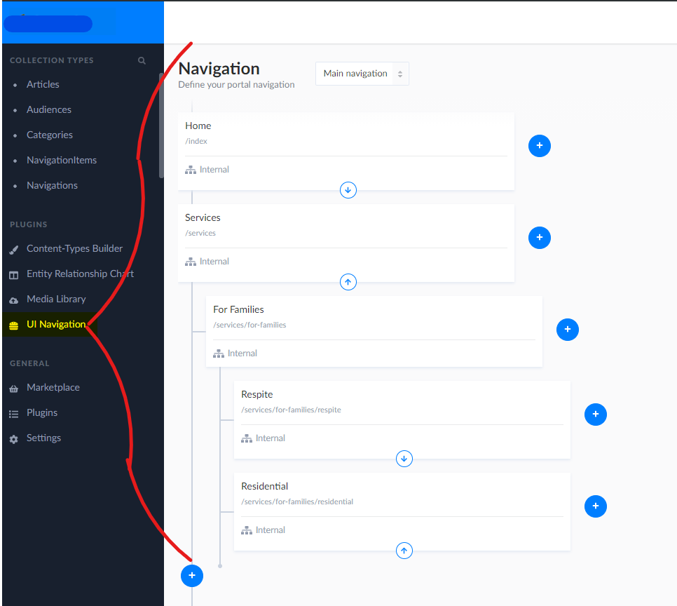
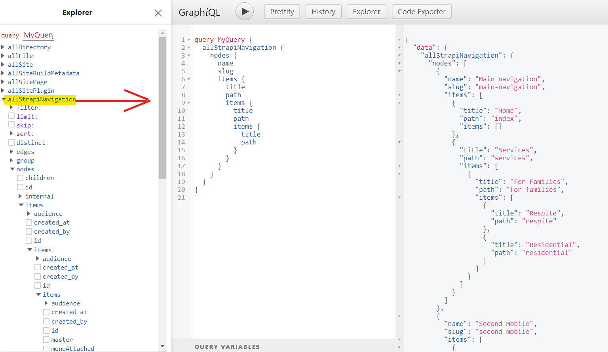

# Forked gatsby-source-strapi-plugin-navigation

Gatsby side companion for strapi-plugin-navigation to get around problems in the graphql implementation of the upstream Strapi plugin. Gatsby dependency version has been bumped up to go around a dependency error due to package age.

Gatsby source plugin for pulling navigation/menu into Gatsby as graphQL nodes from a [strapi](https://github.com/strapi/strapi) instace that uses the [strapi-plugin-navigation](https://www.npmjs.com/package/strapi-plugin-navigation).


## Install

```bash
yarn add gatsby-source-strapi-plugin-navigation
```

## How to use
   In your gatsby-config.js
```js
module.exports = {
  plugins: [
    {
      resolve: `gatsby-source-strapi-plugin-navigation`,
      options: {
        apiURL: `http://localhost:1337`,
        queryLimit: 100,
        navigationEndpoint: [`navigation`],
      },
    },
  ],
};
```


## Strapi plugin navigation example



## GraphiQL example in gatsby



